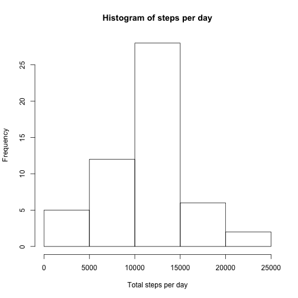
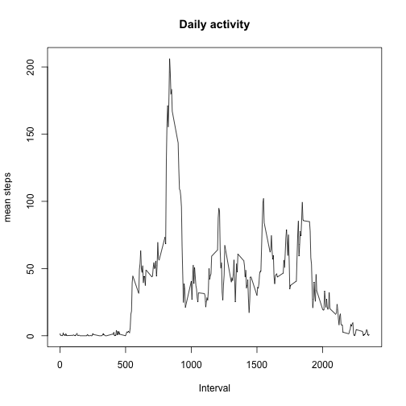
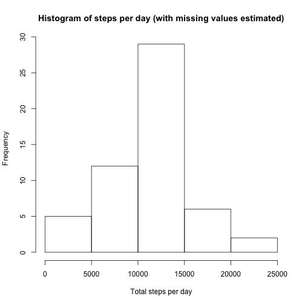
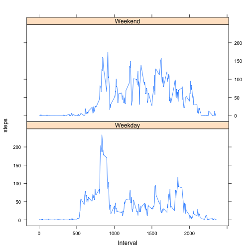

## Loading and preprocessing the data


```r
 activity <- read.csv("activity.csv", colClasses=c("integer","Date","integer"))
```

## What is the mean total number of steps taken per day?


```r
  stepsperday <- aggregate(steps ~ date, activity, sum)

  hist(stepsperday$steps, main="Histogram of steps per day", xlab="Total steps per day")
```

 
      
      
  The mean and median steps per day are given below


```r
  mean(stepsperday["steps"][[1]])
```

```
## [1] 10766.19
```

```r
  median(stepsperday["steps"][[1]])
```

```
## [1] 10765
```

## What is the average daily activity pattern?


```r
  dailyactivity <- aggregate(steps ~ interval, activity, mean)

  plot( dailyactivity$interval, dailyactivity$steps, type="l", xlab="Interval", ylab="mean steps", main="Daily activity")
```

 

  The maximum of the number of steps averaged over each interval is calculated below


```r
  dailyactivity[order(dailyactivity[,2], decreasing=TRUE),][1,]
```

```
##     interval    steps
## 104      835 206.1698
```

  
## Inputting missing values

  The number of cases with missing values for steps is calculated below


```r
nrow(activity[is.na(activity$steps),])
```

```
## [1] 2304
```

  Here is a histogram of steps per day with missing values replaced.
  The new value in each case is the value for the corresponding interval;
  averaged over all days for which data was originally given
     
         
         

```r
  meanspi <- aggregate(steps ~ interval, activity, mean)

  allactivity <- activity
  allactivity$steps[is.na(activity$steps)]  <- meanspi[is.na(activity$steps),"steps"]

  stepsperday <- aggregate(steps ~ date, allactivity, sum)

  hist(stepsperday$steps, main="Histogram of steps per day (with missing values estimated)", xlab="Total steps per day")
```

 
     
  The mean and median are calculated below.
  As can be seen, they differ only slightly from the original mean and median

```r
  mean(stepsperday["steps"][[1]])
```

```
## [1] 10766.19
```

```r
  median(stepsperday["steps"][[1]])
```

```
## [1] 10765.59
```

## Are there differences in activity patterns between weekdays and weekends?

  Here is a pair of graphs showing weekend and weekday activity patterns
  

```r
  allactivity$wday <- ifelse(weekdays(activity$date)=="Saturday" | weekdays(activity$date)=="Sunday", "Weekend", "Weekday")
  allactivity$wday <-  as.factor(allactivity$wday)

  wkend <- aggregate(steps ~ interval, allactivity[allactivity$wday=="Weekend",], mean)
  wkday <- aggregate(steps ~ interval, allactivity[allactivity$wday=="Weekday",], mean)
  wkend$wday="Weekend"
  wkday$wday="Weekday"

  wkdata <- rbind(wkend,wkday)
  wkdata$wday <- as.factor(wkdata$wday)

  library(lattice)

  xyplot(wkdata$steps ~ wkdata$interval | wkdata$wday, layout=c(1,2), type="l", xlab="Interval", ylab="steps")
```

 

The graphs seem to show that at weekends there is a reduction in activity during the early morning
and an increase through the rest of the daytime hours.
